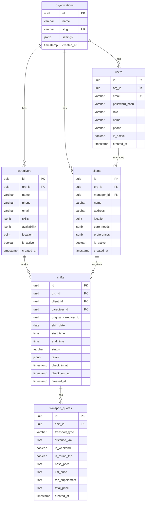

# CuidaFlow - Database Schema v2

## Visão Geral

Arquitetura multi-tenant baseada em **PostgreSQL** com suporte a JSONB para dados flexíveis (skills, preferências). Cada organização opera com isolamento lógico.

---

## Diagrama de Entidades



---

## Tabelas Detalhadas

### 1. `organizations`
Tenant principal. Todas as entidades pertencem a uma organização.

| Coluna | Tipo | Descrição |
|--------|------|-----------|
| `id` | `UUID` | Primary Key |
| `name` | `VARCHAR(255)` | Nome da organização |
| `slug` | `VARCHAR(100)` | Identificador único (URL-friendly) |
| `settings` | `JSONB` | Configurações customizadas (timezone, moeda, etc.) |
| `created_at` | `TIMESTAMP` | Data de criação |

```sql
CREATE TABLE organizations (
    id UUID PRIMARY KEY DEFAULT gen_random_uuid(),
    name VARCHAR(255) NOT NULL,
    slug VARCHAR(100) UNIQUE NOT NULL,
    settings JSONB DEFAULT '{}',
    created_at TIMESTAMP DEFAULT NOW()
);
```

---

### 2. `users`
Utilizadores autenticados (Gestoras, Admins).

| Coluna | Tipo | Descrição |
|--------|------|-----------|
| `id` | `UUID` | Primary Key |
| `org_id` | `UUID` | FK → organizations |
| `email` | `VARCHAR(255)` | Email único (login) |
| `password_hash` | `VARCHAR(255)` | Senha encriptada (bcrypt) |
| `role` | `VARCHAR(50)` | `admin`, `manager`, `viewer` |
| `name` | `VARCHAR(255)` | Nome completo |
| `phone` | `VARCHAR(20)` | Telefone |
| `is_active` | `BOOLEAN` | Estado da conta |
| `created_at` | `TIMESTAMP` | Data de criação |

```sql
CREATE TABLE users (
    id UUID PRIMARY KEY DEFAULT gen_random_uuid(),
    org_id UUID NOT NULL REFERENCES organizations(id) ON DELETE CASCADE,
    email VARCHAR(255) UNIQUE NOT NULL,
    password_hash VARCHAR(255) NOT NULL,
    role VARCHAR(50) NOT NULL CHECK (role IN ('admin', 'manager', 'viewer')),
    name VARCHAR(255) NOT NULL,
    phone VARCHAR(20),
    is_active BOOLEAN DEFAULT TRUE,
    created_at TIMESTAMP DEFAULT NOW()
);

CREATE INDEX idx_users_org ON users(org_id);
CREATE INDEX idx_users_email ON users(email);
```

---

### 3. `caregivers`
Cuidadoras/Auxiliares de ação direta.

| Coluna | Tipo | Descrição |
|--------|------|-----------|
| `id` | `UUID` | Primary Key |
| `org_id` | `UUID` | FK → organizations |
| `name` | `VARCHAR(255)` | Nome completo |
| `phone` | `VARCHAR(20)` | Telefone |
| `email` | `VARCHAR(255)` | Email |
| `skills` | `JSONB` | Array de competências |
| `availability` | `JSONB` | Horários disponíveis por dia |
| `location` | `POINT` | Coordenadas GPS (lat, lng) |
| `is_active` | `BOOLEAN` | Disponível para trabalho |
| `created_at` | `TIMESTAMP` | Data de criação |

**Estrutura JSONB - Skills:**
```json
{
    "skills": [
        "alzheimer",
        "demencia",
        "mobilidade_reduzida",
        "alimentacao_sonda",
        "higiene_pessoal",
        "medicacao",
        "fisioterapia_basica"
    ]
}
```

**Estrutura JSONB - Availability:**
```json
{
    "availability": {
        "monday": [{"start": "08:00", "end": "18:00"}],
        "tuesday": [{"start": "08:00", "end": "14:00"}, {"start": "16:00", "end": "20:00"}],
        "wednesday": [],
        "thursday": [{"start": "08:00", "end": "18:00"}],
        "friday": [{"start": "08:00", "end": "18:00"}],
        "saturday": [{"start": "09:00", "end": "13:00"}],
        "sunday": []
    }
}
```

```sql
CREATE TABLE caregivers (
    id UUID PRIMARY KEY DEFAULT gen_random_uuid(),
    org_id UUID NOT NULL REFERENCES organizations(id) ON DELETE CASCADE,
    name VARCHAR(255) NOT NULL,
    phone VARCHAR(20) NOT NULL,
    email VARCHAR(255),
    skills JSONB DEFAULT '[]',
    availability JSONB DEFAULT '{}',
    location POINT,
    is_active BOOLEAN DEFAULT TRUE,
    created_at TIMESTAMP DEFAULT NOW()
);

CREATE INDEX idx_caregivers_org ON caregivers(org_id);
CREATE INDEX idx_caregivers_skills ON caregivers USING GIN(skills);
CREATE INDEX idx_caregivers_location ON caregivers USING GIST(location);
```

---

### 4. `clients`
Utentes/Clientes que recebem cuidados.

| Coluna | Tipo | Descrição |
|--------|------|-----------|
| `id` | `UUID` | Primary Key |
| `org_id` | `UUID` | FK → organizations |
| `manager_id` | `UUID` | FK → users (Gestora responsável) |
| `name` | `VARCHAR(255)` | Nome completo |
| `address` | `TEXT` | Morada completa |
| `location` | `POINT` | Coordenadas GPS |
| `care_needs` | `JSONB` | Necessidades de cuidado (skills requeridas) |
| `preferences` | `JSONB` | Preferências (horário, género cuidadora, etc.) |
| `is_active` | `BOOLEAN` | Utente ativo |
| `created_at` | `TIMESTAMP` | Data de criação |

**Estrutura JSONB - Care Needs:**
```json
{
    "required_skills": ["alzheimer", "medicacao"],
    "mobility_level": "wheelchair",
    "special_notes": "Alergia a latex"
}
```

```sql
CREATE TABLE clients (
    id UUID PRIMARY KEY DEFAULT gen_random_uuid(),
    org_id UUID NOT NULL REFERENCES organizations(id) ON DELETE CASCADE,
    manager_id UUID REFERENCES users(id) ON DELETE SET NULL,
    name VARCHAR(255) NOT NULL,
    address TEXT NOT NULL,
    location POINT,
    care_needs JSONB DEFAULT '{}',
    preferences JSONB DEFAULT '{}',
    is_active BOOLEAN DEFAULT TRUE,
    created_at TIMESTAMP DEFAULT NOW()
);

CREATE INDEX idx_clients_org ON clients(org_id);
CREATE INDEX idx_clients_manager ON clients(manager_id);
CREATE INDEX idx_clients_care_needs ON clients USING GIN(care_needs);
```

---

### 5. `shifts`
Turnos de trabalho atribuídos.

| Coluna | Tipo | Descrição |
|--------|------|-----------|
| `id` | `UUID` | Primary Key |
| `org_id` | `UUID` | FK → organizations |
| `client_id` | `UUID` | FK → clients |
| `caregiver_id` | `UUID` | FK → caregivers (atual) |
| `original_caregiver_id` | `UUID` | FK → caregivers (original, se substituída) |
| `shift_date` | `DATE` | Data do turno |
| `start_time` | `TIME` | Hora início |
| `end_time` | `TIME` | Hora fim |
| `status` | `VARCHAR(50)` | Estado do turno |
| `tasks` | `JSONB` | Lista de tarefas a executar |
| `check_in_at` | `TIMESTAMP` | Hora de check-in |
| `check_out_at` | `TIMESTAMP` | Hora de check-out |
| `created_at` | `TIMESTAMP` | Data de criação |

**Estados possíveis:**
- `scheduled` - Agendado
- `pending_acceptance` - Aguarda aceitação (após envio de link)
- `confirmed` - Confirmado pela cuidadora
- `in_progress` - Em execução (check-in feito)
- `completed` - Concluído (check-out feito)
- `cancelled` - Cancelado
- `no_show` - Falta

```sql
CREATE TABLE shifts (
    id UUID PRIMARY KEY DEFAULT gen_random_uuid(),
    org_id UUID NOT NULL REFERENCES organizations(id) ON DELETE CASCADE,
    client_id UUID NOT NULL REFERENCES clients(id) ON DELETE CASCADE,
    caregiver_id UUID REFERENCES caregivers(id) ON DELETE SET NULL,
    original_caregiver_id UUID REFERENCES caregivers(id) ON DELETE SET NULL,
    shift_date DATE NOT NULL,
    start_time TIME NOT NULL,
    end_time TIME NOT NULL,
    status VARCHAR(50) DEFAULT 'scheduled' CHECK (status IN (
        'scheduled', 'pending_acceptance', 'confirmed', 
        'in_progress', 'completed', 'cancelled', 'no_show'
    )),
    tasks JSONB DEFAULT '[]',
    check_in_at TIMESTAMP,
    check_out_at TIMESTAMP,
    created_at TIMESTAMP DEFAULT NOW()
);

CREATE INDEX idx_shifts_org ON shifts(org_id);
CREATE INDEX idx_shifts_date ON shifts(shift_date);
CREATE INDEX idx_shifts_caregiver ON shifts(caregiver_id);
CREATE INDEX idx_shifts_client ON shifts(client_id);
CREATE INDEX idx_shifts_status ON shifts(status);
```

---

### 6. `transport_quotes`
Orçamentos de transporte para substituições.

| Coluna | Tipo | Descrição |
|--------|------|-----------|
| `id` | `UUID` | Primary Key |
| `shift_id` | `UUID` | FK → shifts |
| `transport_type` | `VARCHAR(20)` | `normal` ou `adapted` |
| `distance_km` | `FLOAT` | Distância em km |
| `is_weekend` | `BOOLEAN` | É fim de semana? |
| `is_round_trip` | `BOOLEAN` | É ida e volta? |
| `base_price` | `DECIMAL(10,2)` | Preço base |
| `km_price` | `DECIMAL(10,2)` | Custo por km |
| `trip_supplement` | `DECIMAL(10,2)` | Suplemento ida/volta |
| `total_price` | `DECIMAL(10,2)` | Preço total calculado |
| `created_at` | `TIMESTAMP` | Data de criação |

```sql
CREATE TABLE transport_quotes (
    id UUID PRIMARY KEY DEFAULT gen_random_uuid(),
    shift_id UUID NOT NULL REFERENCES shifts(id) ON DELETE CASCADE,
    transport_type VARCHAR(20) NOT NULL CHECK (transport_type IN ('normal', 'adapted')),
    distance_km FLOAT NOT NULL,
    is_weekend BOOLEAN DEFAULT FALSE,
    is_round_trip BOOLEAN DEFAULT FALSE,
    base_price DECIMAL(10,2) NOT NULL,
    km_price DECIMAL(10,2) NOT NULL,
    trip_supplement DECIMAL(10,2) DEFAULT 0,
    total_price DECIMAL(10,2) NOT NULL,
    created_at TIMESTAMP DEFAULT NOW()
);

CREATE INDEX idx_transport_quotes_shift ON transport_quotes(shift_id);
```

---

## Row Level Security (RLS)

Para garantir isolamento multi-tenant:

```sql
-- Enable RLS
ALTER TABLE users ENABLE ROW LEVEL SECURITY;
ALTER TABLE caregivers ENABLE ROW LEVEL SECURITY;
ALTER TABLE clients ENABLE ROW LEVEL SECURITY;
ALTER TABLE shifts ENABLE ROW LEVEL SECURITY;

-- Policy example (users só vêem dados da sua org)
CREATE POLICY org_isolation ON users
    FOR ALL
    USING (org_id = current_setting('app.current_org_id')::uuid);
```

---

## Extensões PostgreSQL Recomendadas

```sql
CREATE EXTENSION IF NOT EXISTS "uuid-ossp";      -- UUID generation
CREATE EXTENSION IF NOT EXISTS "postgis";         -- Geolocation
CREATE EXTENSION IF NOT EXISTS "pg_trgm";         -- Text search
```
