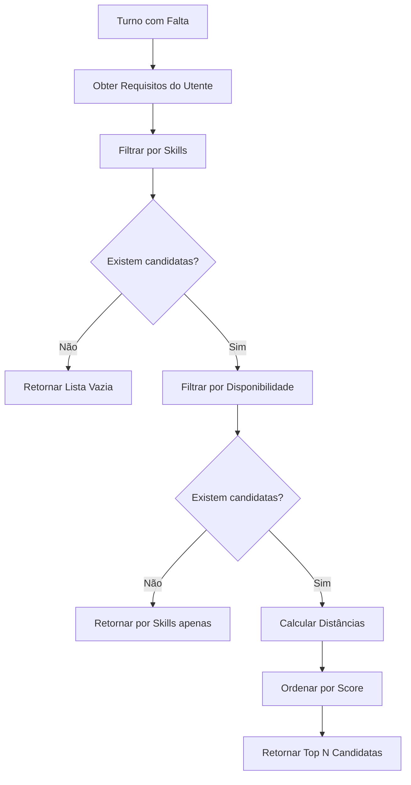

# CuidaFlow - Algoritmo de Substituição

## Visão Geral

O algoritmo de matching para substituição de cuidadoras segue três prioridades ordenadas:

1. **Competências (Skills)** - Match obrigatório com necessidades do utente
2. **Disponibilidade** - Horário livre no período do turno
3. **Proximidade** - Distância geográfica (geofencing secundário)

---

## Diagrama de Fluxo



---

## Pseudo-código

### Função Principal

```python
def find_replacement_caregivers(
    shift_id: UUID,
    max_results: int = 5,
    max_distance_km: float = 50.0
) -> List[CaregiverMatch]:
    """
    Encontra cuidadoras substitutas para um turno com falta.
    
    Args:
        shift_id: ID do turno que precisa de substituição
        max_results: Número máximo de resultados
        max_distance_km: Distância máxima de busca
    
    Returns:
        Lista ordenada de CaregiverMatch com score
    """
    
    # 1. Obter dados do turno e utente
    shift = get_shift(shift_id)
    client = get_client(shift.client_id)
    
    # 2. Obter skills necessárias do utente
    required_skills = client.care_needs.get('required_skills', [])
    
    # 3. Obter todas as cuidadoras ativas da organização
    all_caregivers = get_active_caregivers(shift.org_id)
    
    # 4. PRIORIDADE 1: Filtrar por Skills
    skill_matched = filter_by_skills(all_caregivers, required_skills)
    
    if not skill_matched:
        return []  # Sem candidatas qualificadas
    
    # 5. PRIORIDADE 2: Filtrar por Disponibilidade
    available = filter_by_availability(
        skill_matched,
        shift.shift_date,
        shift.start_time,
        shift.end_time
    )
    
    # 6. PRIORIDADE 3: Calcular proximidade e score
    candidates = []
    for caregiver in available:
        distance = calculate_distance(
            caregiver.location,
            client.location
        )
        
        if distance <= max_distance_km:
            score = calculate_match_score(
                caregiver,
                required_skills,
                distance
            )
            candidates.append(CaregiverMatch(
                caregiver=caregiver,
                distance_km=distance,
                score=score,
                skills_match=get_matching_skills(caregiver, required_skills)
            ))
    
    # 7. Ordenar por score (maior primeiro)
    candidates.sort(key=lambda x: x.score, reverse=True)
    
    # 8. Retornar top N
    return candidates[:max_results]
```

---

### Filtro de Skills

```python
def filter_by_skills(
    caregivers: List[Caregiver],
    required_skills: List[str]
) -> List[Caregiver]:
    """
    Filtra cuidadoras que possuem TODAS as skills requeridas.
    
    Match é obrigatório - sem as skills certas, não é candidata.
    """
    matched = []
    
    for caregiver in caregivers:
        caregiver_skills = set(caregiver.skills)
        required = set(required_skills)
        
        # Todas as skills requeridas devem estar presentes
        if required.issubset(caregiver_skills):
            matched.append(caregiver)
    
    return matched


def get_matching_skills(
    caregiver: Caregiver,
    required_skills: List[str]
) -> dict:
    """
    Retorna detalhes do match de skills.
    """
    caregiver_skills = set(caregiver.skills)
    required = set(required_skills)
    
    return {
        'matched': list(required.intersection(caregiver_skills)),
        'extra': list(caregiver_skills - required),  # Skills adicionais
        'match_percentage': len(required.intersection(caregiver_skills)) / len(required) * 100
    }
```

---

### Filtro de Disponibilidade

```python
def filter_by_availability(
    caregivers: List[Caregiver],
    shift_date: date,
    start_time: time,
    end_time: time
) -> List[Caregiver]:
    """
    Filtra cuidadoras disponíveis no horário do turno.
    
    Verifica:
    1. Se tem slots de disponibilidade no dia da semana
    2. Se o slot cobre o período do turno
    3. Se não tem outro turno agendado no mesmo período
    """
    day_name = shift_date.strftime('%A').lower()  # 'monday', 'tuesday', etc.
    available = []
    
    for caregiver in caregivers:
        # Verificar slots de disponibilidade
        day_slots = caregiver.availability.get(day_name, [])
        
        is_available = False
        for slot in day_slots:
            slot_start = parse_time(slot['start'])
            slot_end = parse_time(slot['end'])
            
            # O slot deve cobrir todo o período do turno
            if slot_start <= start_time and slot_end >= end_time:
                is_available = True
                break
        
        if not is_available:
            continue
        
        # Verificar conflitos com turnos existentes
        has_conflict = check_shift_conflict(
            caregiver.id,
            shift_date,
            start_time,
            end_time
        )
        
        if not has_conflict:
            available.append(caregiver)
    
    return available


def check_shift_conflict(
    caregiver_id: UUID,
    shift_date: date,
    start_time: time,
    end_time: time
) -> bool:
    """
    Verifica se a cuidadora já tem turno agendado que conflita.
    """
    existing_shifts = db.query("""
        SELECT id FROM shifts
        WHERE caregiver_id = :caregiver_id
        AND shift_date = :shift_date
        AND status NOT IN ('cancelled', 'no_show')
        AND (
            (start_time <= :start_time AND end_time > :start_time) OR
            (start_time < :end_time AND end_time >= :end_time) OR
            (start_time >= :start_time AND end_time <= :end_time)
        )
    """, {
        'caregiver_id': caregiver_id,
        'shift_date': shift_date,
        'start_time': start_time,
        'end_time': end_time
    })
    
    return len(existing_shifts) > 0
```

---

### Cálculo de Distância e Score

```python
def calculate_distance(
    point1: Point,
    point2: Point
) -> float:
    """
    Calcula distância em km entre dois pontos GPS.
    Usa fórmula de Haversine.
    """
    from math import radians, cos, sin, asin, sqrt
    
    R = 6371  # Raio da Terra em km
    
    lat1, lon1 = radians(point1.lat), radians(point1.lng)
    lat2, lon2 = radians(point2.lat), radians(point2.lng)
    
    dlat = lat2 - lat1
    dlon = lon2 - lon1
    
    a = sin(dlat/2)**2 + cos(lat1) * cos(lat2) * sin(dlon/2)**2
    c = 2 * asin(sqrt(a))
    
    return R * c


def calculate_match_score(
    caregiver: Caregiver,
    required_skills: List[str],
    distance_km: float
) -> float:
    """
    Calcula score de matching (0-100).
    
    Pesos:
    - Skills extras: +10 pontos bonus por skill adicional relevante
    - Distância: Penalização progressiva
    - Histórico: Bonus se já trabalhou com o utente
    """
    base_score = 100.0
    
    # Bonus por skills extras (máx 20 pontos)
    caregiver_skills = set(caregiver.skills)
    required = set(required_skills)
    extra_skills = caregiver_skills - required
    
    # Skills extras relevantes (ex: primeiros_socorros sempre útil)
    valuable_extras = ['primeiros_socorros', 'lingua_gestual', 'suporte_emocional']
    bonus_skills = len(extra_skills.intersection(valuable_extras))
    skill_bonus = min(bonus_skills * 10, 20)
    
    # Penalização por distância (0-30 pontos)
    # 0km = 0 penalização, 50km = 30 pontos penalização
    distance_penalty = min((distance_km / 50) * 30, 30)
    
    # Score final
    score = base_score + skill_bonus - distance_penalty
    
    return max(0, min(100, score))  # Clamp entre 0 e 100
```

---

## Estrutura de Retorno

```python
@dataclass
class CaregiverMatch:
    caregiver: Caregiver          # Dados completos da cuidadora
    distance_km: float            # Distância ao utente
    score: float                  # Score de matching (0-100)
    skills_match: dict            # Detalhes do match de skills
    estimated_travel_time: int    # Tempo estimado em minutos (opcional)
```

**Exemplo de resposta JSON:**

```json
{
    "matches": [
        {
            "caregiver": {
                "id": "uuid-123",
                "name": "Maria Silva",
                "phone": "+351 912 345 678",
                "skills": ["alzheimer", "medicacao", "higiene_pessoal"]
            },
            "distance_km": 3.2,
            "score": 95.5,
            "skills_match": {
                "matched": ["alzheimer", "medicacao"],
                "extra": ["higiene_pessoal"],
                "match_percentage": 100
            },
            "estimated_travel_time": 12
        },
        {
            "caregiver": {
                "id": "uuid-456",
                "name": "Ana Costa",
                "phone": "+351 923 456 789",
                "skills": ["alzheimer", "medicacao", "mobilidade_reduzida"]
            },
            "distance_km": 8.7,
            "score": 88.2,
            "skills_match": {
                "matched": ["alzheimer", "medicacao"],
                "extra": ["mobilidade_reduzida"],
                "match_percentage": 100
            },
            "estimated_travel_time": 22
        }
    ],
    "total_candidates": 2,
    "search_radius_km": 50
}
```

---

## Query SQL Otimizada

Para performance, usar uma única query com CTEs:

```sql
WITH shift_details AS (
    SELECT 
        s.id AS shift_id,
        s.shift_date,
        s.start_time,
        s.end_time,
        s.org_id,
        c.location AS client_location,
        c.care_needs->'required_skills' AS required_skills
    FROM shifts s
    JOIN clients c ON s.client_id = c.id
    WHERE s.id = :shift_id
),
available_caregivers AS (
    SELECT 
        cg.*,
        ST_Distance(
            cg.location::geography,
            sd.client_location::geography
        ) / 1000 AS distance_km
    FROM caregivers cg
    CROSS JOIN shift_details sd
    WHERE cg.org_id = sd.org_id
    AND cg.is_active = TRUE
    AND cg.id != (SELECT caregiver_id FROM shifts WHERE id = :shift_id)
    -- Skills match (usando operador @> do JSONB)
    AND cg.skills @> sd.required_skills
    -- Distância máxima
    AND ST_DWithin(
        cg.location::geography,
        sd.client_location::geography,
        :max_distance_meters
    )
)
SELECT *
FROM available_caregivers
ORDER BY distance_km ASC
LIMIT :max_results;
```
