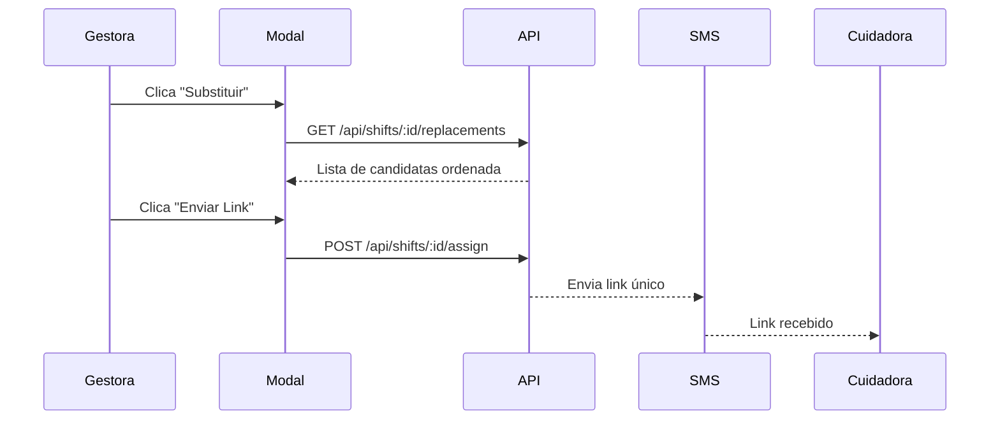

# CuidaFlow - UI Roadmap

## Design System (Kimi Style)

### Paleta de Cores

```css
:root {
  /* Primary - Azul vibrante e acessível */
  --primary-50: #E8F4FD;
  --primary-100: #C5E4FA;
  --primary-500: #2196F3;
  --primary-600: #1E88E5;
  --primary-700: #1976D2;
  
  /* Secondary - Coral suave para CTAs */
  --secondary-500: #FF6B6B;
  --secondary-600: #EE5A5A;
  
  /* Success/Warning/Error */
  --success: #4CAF50;
  --warning: #FF9800;
  --error: #F44336;
  
  /* Neutrals */
  --gray-50: #FAFAFA;
  --gray-100: #F5F5F5;
  --gray-200: #EEEEEE;
  --gray-500: #9E9E9E;
  --gray-800: #424242;
  --gray-900: #212121;
  
  /* Surfaces */
  --surface: #FFFFFF;
  --surface-elevated: #FFFFFF;
  --background: #F8FAFC;
}
```

### Tipografia

```css
:root {
  --font-family: 'Inter', -apple-system, BlinkMacSystemFont, sans-serif;
  
  /* Scale */
  --text-xs: 0.75rem;    /* 12px */
  --text-sm: 0.875rem;   /* 14px */
  --text-base: 1rem;     /* 16px */
  --text-lg: 1.125rem;   /* 18px */
  --text-xl: 1.25rem;    /* 20px */
  --text-2xl: 1.5rem;    /* 24px */
  --text-3xl: 1.875rem;  /* 30px */
}
```

### Componentes Base

| Componente | Especificações |
|------------|----------------|
| **Button Primary** | `bg: primary-500`, `radius: 12px`, `padding: 12px 24px`, `shadow: sm` |
| **Button Danger** | `bg: error`, `radius: 12px`, hover glow effect |
| **Card** | `bg: surface`, `radius: 16px`, `shadow: md`, `padding: 20px` |
| **Input** | `border: gray-200`, `radius: 12px`, `height: 48px`, focus ring |
| **Badge** | `radius: 20px`, `padding: 4px 12px`, variantes por estado |
| **Avatar** | Circular, `40px/48px/56px`, iniciais como fallback |

---

## Ecrã 1: Dashboard Gestora

### Layout

```
┌─────────────────────────────────────────────────────────┐
│  🏠 CuidaFlow          🔔 3    👤 Sara                  │
├─────────────────────────────────────────────────────────┤
│                                                         │
│  ┌─────────────────────────────────────────────────┐   │
│  │  ⚠️  ALERTAS HOJE                         Ver →  │   │
│  │  ┌─────────┐ ┌─────────┐ ┌─────────┐           │   │
│  │  │ 🔴 2    │ │ 🟡 5    │ │ 🟢 23   │           │   │
│  │  │ Faltas  │ │ Pending │ │ Confirm │           │   │
│  │  └─────────┘ └─────────┘ └─────────┘           │   │
│  └─────────────────────────────────────────────────┘   │
│                                                         │
│  📋 TURNOS COM PROBLEMA                                │
│  ┌─────────────────────────────────────────────────┐   │
│  │  👤 Maria Santos        08:00 - 14:00          │   │
│  │  📍 Utente: José Silva                         │   │
│  │  🔴 FALTA                    [Substituir →]    │   │
│  └─────────────────────────────────────────────────┘   │
│  ┌─────────────────────────────────────────────────┐   │
│  │  👤 Ana Costa           14:00 - 20:00          │   │
│  │  📍 Utente: Rosa Ferreira                      │   │
│  │  🟡 Atraso 15min             [Ver →]           │   │
│  └─────────────────────────────────────────────────┘   │
│                                                         │
├─────────────────────────────────────────────────────────┤
│  🏠        📅        👥        ⚙️                       │
│  Home    Agenda   Equipa    Config                     │
└─────────────────────────────────────────────────────────┘
```

### Componentes

1. **Header** - Logo, notificações (badge count), avatar
2. **AlertCard** - Resumo de estado (Faltas, Pendentes, Confirmados)
3. **ShiftCard** - Turno com problema, CTA "Substituir"
4. **BottomNav** - Navegação principal (4 tabs)

---

## Ecrã 2: Modal de Substituição

### Layout

```
┌─────────────────────────────────────────────────────────┐
│              Substituir Cuidadora              ✕       │
├─────────────────────────────────────────────────────────┤
│  ┌─────────────────────────────────────────────────┐   │
│  │  TURNO ORIGINAL                                 │   │
│  │  👤 Maria Santos (FALTA)                       │   │
│  │  📅 08/02/2026  ⏰ 08:00 - 14:00               │   │
│  │  📍 José Silva, Rua da Paz 123, Lisboa         │   │
│  │  🏥 Alzheimer, Medicação                       │   │
│  └─────────────────────────────────────────────────┘   │
│                                                         │
│  ⭐ MELHORES SUBSTITUTAS                               │
│  ┌─────────────────────────────────────────────────┐   │
│  │  👤 Ana Costa                    ⭐ 95.5       │   │
│  │  📍 3.2 km  •  ~12 min                         │   │
│  │  ✓ Alzheimer  ✓ Medicação  + Higiene          │   │
│  │  ┌────────────────────────────────────────┐   │   │
│  │  │  📞 Contactar           🔗 Enviar Link │   │   │
│  │  └────────────────────────────────────────┘   │   │
│  └─────────────────────────────────────────────────┘   │
│  ┌─────────────────────────────────────────────────┐   │
│  │  👤 Carla Dias                   ⭐ 88.2       │   │
│  │  📍 8.7 km  •  ~22 min                         │   │
│  │  ✓ Alzheimer  ✓ Medicação                     │   │
│  │  ┌────────────────────────────────────────┐   │   │
│  │  │  📞 Contactar           🔗 Enviar Link │   │   │
│  │  └────────────────────────────────────────┘   │   │
│  └─────────────────────────────────────────────────┘   │
│                                                         │
│  💰 ORÇAMENTO TRANSPORTE                    [Expandir]  │
└─────────────────────────────────────────────────────────┘
```

### Componentes

1. **ShiftSummary** - Info do turno original
2. **CaregiverMatchCard** - Candidata com score, distância, skills
3. **ActionButtons** - "Contactar" (tel:) e "Enviar Link"
4. **TransportQuoteAccordion** - Orçamento colapsável

### Fluxo



---

## Ecrã 3: View da Cuidadora (Pós-link)

### Fluxo de Acesso

```
SMS: "Tens um turno atribuído. Aceita aqui: cuidaflow.pt/t/abc123"
                ↓
        [Clica no link]
                ↓
    ┌─────────────────────┐
    │  Aceitar Turno?     │
    │  [Aceitar] [Recusar]│
    └─────────────────────┘
                ↓ Aceita
        [Dashboard de Execução]
```

### Layout (Dashboard Execução)

```
┌─────────────────────────────────────────────────────────┐
│  CuidaFlow                              08/02 • 08:00   │
├─────────────────────────────────────────────────────────┤
│                                                         │
│  ┌─────────────────────────────────────────────────┐   │
│  │  👤 José Silva                                  │   │
│  │  📍 Rua da Paz 123, 3º Esq, Lisboa             │   │
│  │  📞 +351 912 345 678                           │   │
│  │                                                 │   │
│  │  ⚠️ Notas: Alergia a latex. Gosta de música   │   │
│  │           clássica. Filho contactável.         │   │
│  └─────────────────────────────────────────────────┘   │
│                                                         │
│  ┌─────────────────────────────────────────────────┐   │
│  │           ┌──────────────────────┐              │   │
│  │           │   📍 CHECK-IN        │              │   │
│  │           │   (Geolocalização)   │              │   │
│  │           └──────────────────────┘              │   │
│  └─────────────────────────────────────────────────┘   │
│                                                         │
│  📋 TAREFAS                                            │
│  ┌─────────────────────────────────────────────────┐   │
│  │  ☐  Higiene pessoal (banho assistido)          │   │
│  │  ☐  Administrar medicação (ver lista)          │   │
│  │  ☐  Preparar pequeno-almoço                    │   │
│  │  ☐  Exercícios de mobilidade (15 min)          │   │
│  └─────────────────────────────────────────────────┘   │
│                                                         │
└─────────────────────────────────────────────────────────┘
```

### Após Check-in

```
┌─────────────────────────────────────────────────────────┐
│  ✅ Check-in às 08:02                                   │
├─────────────────────────────────────────────────────────┤
│  📋 TAREFAS                                            │
│  ┌─────────────────────────────────────────────────┐   │
│  │  ✅  Higiene pessoal (banho assistido)         │   │
│  │  ☐  Administrar medicação (ver lista)          │   │
│  │  ☐  Preparar pequeno-almoço                    │   │
│  │  ☐  Exercícios de mobilidade (15 min)          │   │
│  └─────────────────────────────────────────────────┘   │
│                                                         │
│  ┌─────────────────────────────────────────────────┐   │
│  │           ┌──────────────────────┐              │   │
│  │           │   📍 CHECK-OUT       │              │   │
│  │           │   (Desabilitado)     │              │   │
│  │           └──────────────────────┘              │   │
│  └─────────────────────────────────────────────────┘   │
└─────────────────────────────────────────────────────────┘
```

### Componentes

1. **ClientInfoCard** - Dados do utente, notas importantes
2. **CheckInButton** - GPS-enabled, muda para Check-out após
3. **TaskList** - Checkboxes interativas
4. **MedicationModal** - Lista detalhada de meds (popup)

---

## Mobile-First Breakpoints

```css
/* Mobile first */
.container { max-width: 100%; padding: 16px; }

/* Tablet */
@media (min-width: 768px) {
  .container { max-width: 720px; padding: 24px; }
}

/* Desktop */
@media (min-width: 1024px) {
  .container { max-width: 1024px; }
}
```

---

## Tech Stack Recomendado

| Camada | Tecnologia |
|--------|------------|
| **Frontend** | Next.js 14 (App Router) + PWA |
| **Styling** | Tailwind CSS + shadcn/ui |
| **State** | Zustand ou Jotai |
| **Backend** | Supabase (Auth, DB, Realtime) |
| **Maps** | Mapbox ou Google Maps |
| **SMS** | Twilio ou MessageBird |
